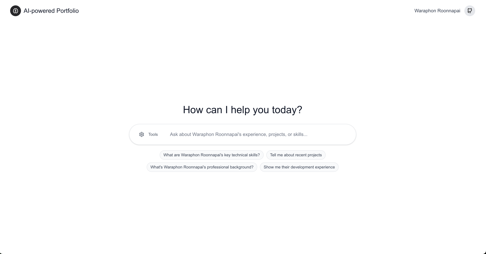

# 🤖 AI-Powered Portfolio Assistant

A modern, interactive portfolio assistant built with Next.js 15, featuring AI-powered chat interface, suggestion badges, and comprehensive document management. Uses RAG (Retrieval-Augmented Generation) with Pinecone vector database for intelligent responses.

## 🌐 Live Demo

**Try it live:** [https://ai-chat.roonnapai.dev/](https://ai-chat.roonnapai.dev/)



## ✨ Features

### 🎯 **Interactive Chat Interface**
- **Smart Suggestion Badges**: Context-aware question suggestions
- **Responsive Design**: Mobile-optimized with adaptive UI
- **Real-time Typing Indicators**: Professional loading states
- **Markdown Support**: Rich text formatting in responses
- **Auto-scroll Control**: Manual scroll control with floating button

### 🔧 **AI & RAG System**
- **Vector-based Knowledge Retrieval**: Powered by Pinecone & LangChain
- **Professional AI Responses**: Detailed, comprehensive answers
- **Context-aware Suggestions**: Dynamic follow-up questions
- **Optimized Embeddings**: Fast, accurate content matching

### 📱 **Modern Tech Stack**
- **Next.js 15**: App Router with React 19
- **TypeScript**: Full type safety
- **Tailwind CSS 4**: Modern styling with design system
- **Radix UI**: Accessible component library
- **CORS Security**: Environment-based domain control

### 🛡️ **Admin Panel & Security**
- **Document Management**: Upload, delete, and manage content
- **Password Protection**: Secure admin access
- **Auto-disable**: Security-first approach
- **Environment Configuration**: Production-ready deployment

## 🚀 Quick Start

### 1. **Prerequisites**
- Node.js 18+ 
- pnpm (recommended) or npm
- OpenAI API key
- Pinecone account

### 2. **Installation**

```bash
# Clone the repository
git clone <your-repo-url>
cd ai-interface

# Install dependencies
pnpm install
```

### 3. **Environment Setup**

```bash
# Copy the sample environment file
cp .env.sample .env.local

# Edit .env.local with your API keys
nano .env.local
```

### 4. **Required Environment Variables**

```bash
# OpenAI Configuration
OPENAI_API_KEY=sk-proj-your-openai-api-key-here
PINECONE_API_KEY=pcsk_your-pinecone-api-key-here
PINECONE_INDEX_NAME=portfolio-knowledge

# Portfolio Configuration
NEXT_PUBLIC_PORTFOLIO_NAME=Your Name

# Security & CORS
ADMIN_PASSWORD=your-secure-password
ALLOWED_DOMAINS=http://localhost:3000

# Optional AI Models
OPENAI_MODEL=gpt-4-turbo-preview
EMBEDDING_MODEL=text-embedding-3-small
```

### 5. **Database Setup**

```bash
# Create Pinecone index
pnpm run setup-pinecone

# Upload your portfolio data
pnpm run upload
```

### 6. **Development**

```bash
# Start development server
pnpm dev

# Open http://localhost:3000
```

## 📋 Available Commands

```bash
# Development
pnpm dev              # Start development server
pnpm build            # Build for production
pnpm start            # Start production server
pnpm lint             # Run ESLint

# Database Management
pnpm run setup-pinecone           # Create Pinecone index
pnpm run upload                   # Upload portfolio documents
pnpm run purge-pinecone -- --force # Clear all vector data
```

## 💡 Usage Guide

### **Chat Interface**
- **Initial Suggestions**: Click suggested questions on the landing page
- **Follow-up Questions**: Use context-aware badges that appear during chat
- **Mobile Experience**: Suggestions auto-hide on mobile for better UX
- **Scroll Control**: Use the floating down arrow to navigate long responses

### **Content Management**
1. Edit `data/portfolio-info.txt` with your information
2. Use admin panel at `/admin` for document management
3. Upload additional files via admin interface

## 🛡️ Admin Panel

Access the secure admin panel at `/admin` for content management.

### **Features**
- 📤 **Upload Documents**: Support for .txt, .md files
- 🗑️ **Document Management**: View and delete uploaded content
- 📊 **Statistics**: Monitor document count and status
- 🔒 **Password Protection**: Secure access control
- 🚫 **Auto-disable**: Automatically disabled without password

### **Security**
- If `ADMIN_PASSWORD` is not set, admin panel is completely disabled
- All uploads are vectorized and stored securely
- Password validation on every request

## 🚀 Deployment

### **Production Setup**

1. **Environment Configuration**
```bash
# Production environment variables
NEXT_PUBLIC_PORTFOLIO_NAME=Your Real Name
ADMIN_PASSWORD=your-very-secure-password
ALLOWED_DOMAINS=https://yourdomain.com
OPENAI_API_KEY=your-production-api-key
PINECONE_API_KEY=your-pinecone-api-key
```

2. **Deploy to Platform**
   - Vercel: Connect GitHub repo, set environment variables
   - Netlify: Deploy with build command `pnpm build`
   - Docker: Use included production configuration

3. **Post-Deployment**
   - Upload your portfolio data via admin panel
   - Test chat functionality
   - Verify CORS settings for your domain

### **Scaling Considerations**
- **Rate Limiting**: Consider implementing API rate limits
- **Caching**: Add Redis for response caching
- **Monitoring**: Set up logging and error tracking

## 📁 Project Structure

```
src/
├── app/
│   ├── admin/                    # 🛡️ Admin panel for content management
│   ├── api/
│   │   ├── chat/                # 🤖 AI chat endpoint with RAG
│   │   ├── documents/           # 📄 Document upload/management
│   │   └── admin/auth/          # 🔐 Admin authentication
│   └── page.tsx                 # 🏠 Main chat interface
├── components/
│   └── ui/
│       ├── button.tsx           # 🎨 UI components
│       ├── input.tsx
│       └── suggestion-badge.tsx  # 💡 Smart suggestion badges
└── lib/
    └── utils.ts                 # 🔧 Utility functions

data/
└── portfolio-info.txt           # 📝 Your portfolio content

scripts/
├── setup-pinecone.ts           # 🗄️ Initialize vector database
├── upload-documents.ts         # ⬆️ Upload portfolio data
└── purge-pinecone.ts          # 🗑️ Clear all data
```

## 🔧 API Endpoints

- `POST /api/chat` - AI chat with RAG responses
- `GET /api/documents` - List uploaded documents  
- `POST /api/documents` - Upload new documents
- `DELETE /api/documents` - Remove documents
- `POST /api/admin/auth` - Admin authentication

## 🎨 Tech Stack Details

- **Frontend**: Next.js 15, React 19, TypeScript
- **Styling**: Tailwind CSS 4, Radix UI, CVA
- **AI/ML**: OpenAI GPT-4, LangChain, Pinecone Vector DB
- **Security**: Environment-based CORS, Password protection
- **Package Manager**: pnpm (faster, more efficient)

## 🤝 Contributing

1. Fork the repository
2. Create a feature branch
3. Make your changes
4. Test thoroughly
5. Submit a pull request

## 📄 License

This project is licensed under the MIT License.

---

**Built with ❤️ using Next.js, OpenAI, and Pinecone**
